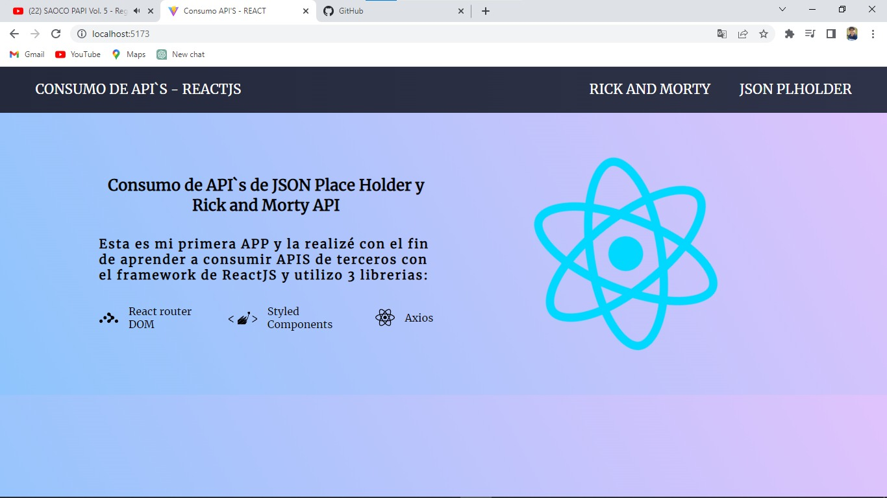
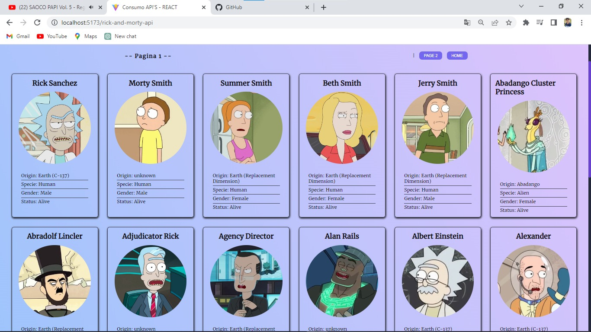
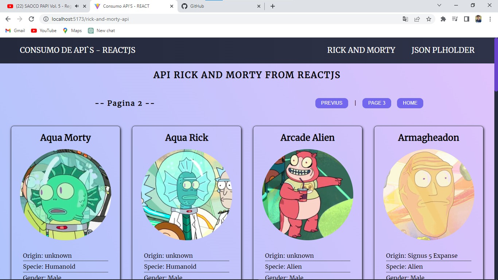
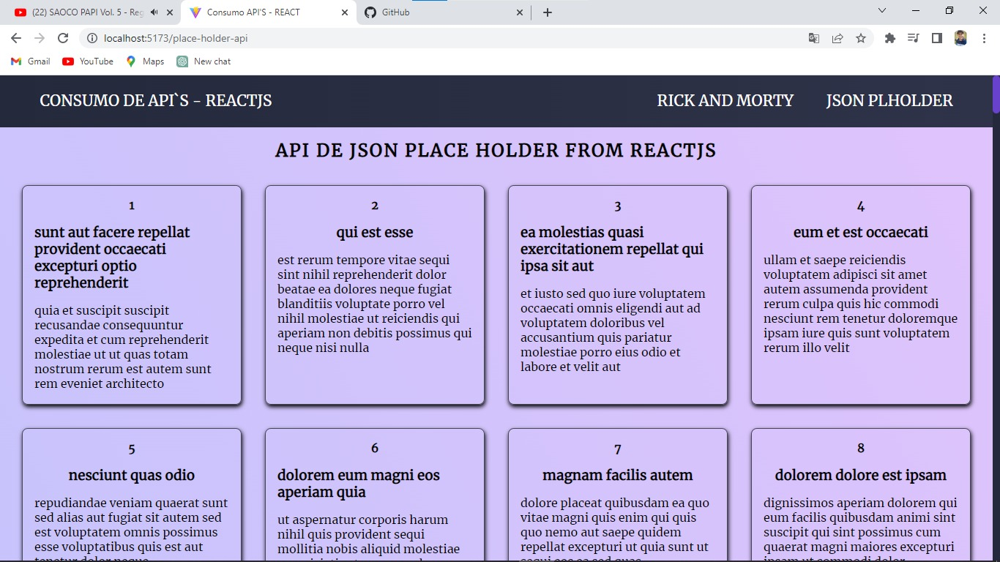

# API react-rick-and-morty AND Json PlaceHolder

Aplicacion hecha en Framework de Javascritp "React" con el fin de aprender a consumir APIs de Rick and Morty y JSONPlaceHolder.

Requisitos para poder usar o ver el respositorio en su equipo local
1. Tener Instalado NodeJs version LTS o Actual.
2. Tener Instalado Git en su equipo.

## Uso del Repo

1. Clonar el repositorio `git clone https://github.com/JuanLaurencio1105/react-rick-and-morty.git`.
2. Muevete a la raiz de tu proyecto `cd react-rick-and-morty`.
3. instalar las dependencias `npm install`.
4. iniciar el servidor de desarrollo `npm run dev`.

## Referencias
El APP tiene 3 páginas, en donde se muestra una página de inicio donde muestra una pequeña informacion y las otras dos páginas muestran el contenido del consumo de API **Characters(personajes)** y **Posts(publicaciones)**

## Imágenes
  1. Vista de la pagina principal.
  
  
  2. Consumo de API **`Rick and Morty`** con el endpoint **`/character`** la cual obtenemos todos los registros de los personajes, cuenta con una paginacion sencilla para mostrar todos los personajes por secciones.

  

  

  3. Consumo de API **`JSONPLACEHOLDER`** endpoint **`/posts`** la cual contiene 100 posts para realizar las consultas.

  

## Librerías utilizadas
  1. **`axios`** es un paquete que nos permite hacer peticiones o llamadas al contenido de un enlace HTTP, para el consumo de API.
  2. **`styled-components`** es una librería que nos permite estilizar nuestras aplicaciones o componentes.
  3. **`react-router-dom`** es una librería que se utiliza para enrutar las páginas y componentes.